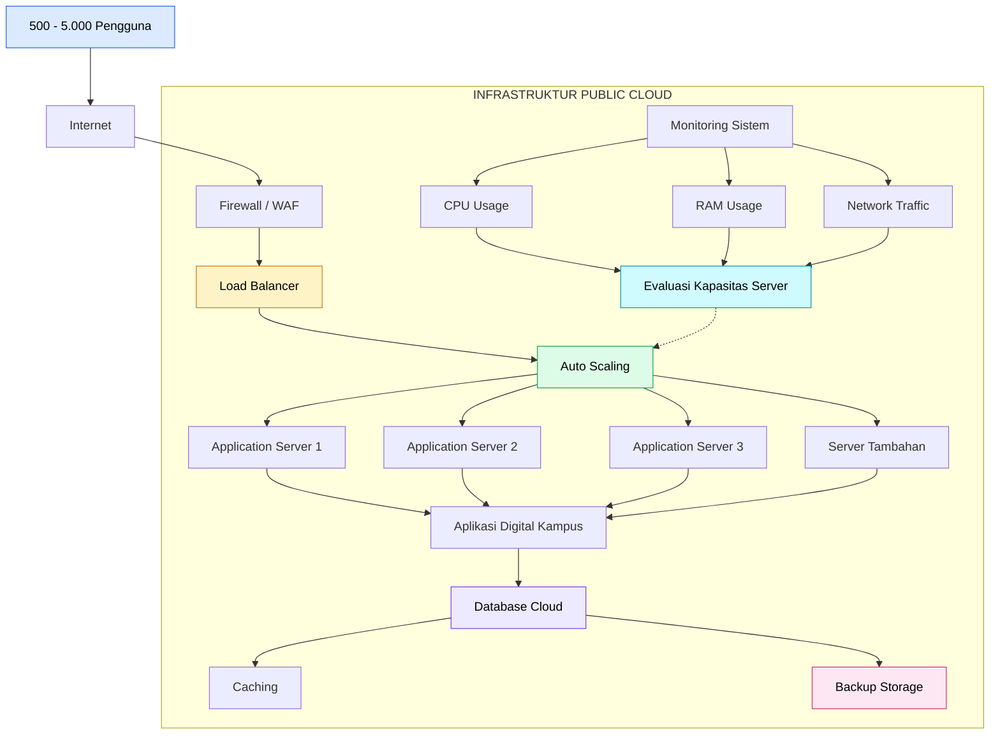

# GAMBARAN SKALABILITAS CLOUD DIGITAL KAMPUS

```mermaid
flowchart TD
    A["500 - 5.000 Pengguna"]
    B["Internet"]
    C["Firewall / WAF"]
    D["Load Balancer"]
    E["Auto Scaling"]

    A --> B
    B --> C
    C --> D
    D --> E

    E --> F["Application Server 1"]
    E --> G["Application Server 2"]
    E --> H["Application Server 3"]
    E --> I["Server Tambahan"]

    F --> J["Aplikasi Digital Kampus"]
    G --> J
    H --> J
    I --> J

    J --> K["Database Cloud"]
    K --> L["Caching"]
    K --> M["Backup Storage"]

    N["Monitoring Sistem"]
    N --> O["CPU Usage"]
    N --> P["RAM Usage"]
    N --> Q["Network Traffic"]

    O --> R["Evaluasi Kapasitas Server"]
    P --> R
    Q --> R

    R -.-> E

    subgraph CLOUD["INFRASTRUKTUR PUBLIC CLOUD"]
        C
        D
        E
        F
        G
        H
        I
        J
        K
        L
        M
        N
        O
        P
        Q
        R
    end

    style A fill:#dbeafe,stroke:#2563eb,color:#000
    style D fill:#fef3c7,stroke:#d97706,color:#000
    style E fill:#dcfce7,stroke:#16a34a,color:#000
    style K fill:#ede9fe,stroke:#7c3aed,color:#000
    style M fill:#fce7f3,stroke:#db2777,color:#000
    style R fill:#cffafe,stroke:#0891b2,color:#000
```
