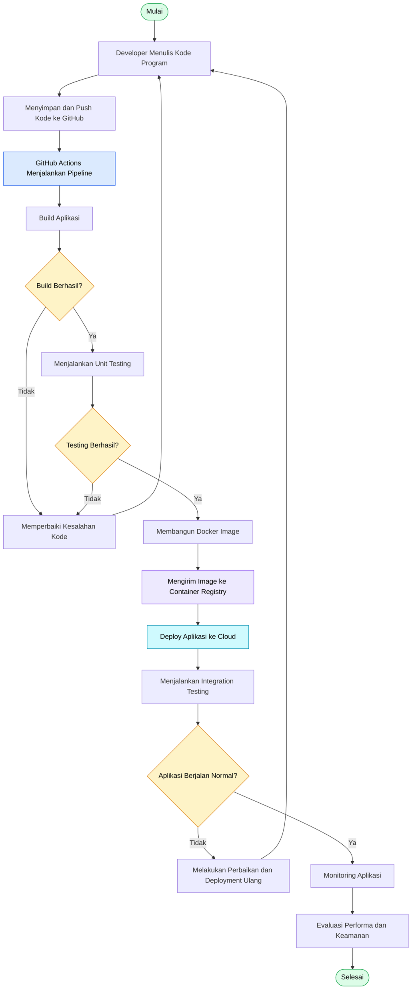

# DIAGRAM PIPELINE CI/CD

```mermaid
flowchart TD
    A([Mulai]) --> B["Developer Menulis Kode Program"]
    B --> C["Menyimpan dan Push Kode ke GitHub"]
    C --> D["GitHub Actions Menjalankan Pipeline"]
    
    D --> E["Build Aplikasi"]
    E --> F{"Build Berhasil?"}

    F -- "Tidak" --> G["Memperbaiki Kesalahan Kode"]
    G --> B

    F -- "Ya" --> H["Menjalankan Unit Testing"]
    H --> I{"Testing Berhasil?"}

    I -- "Tidak" --> G
    I -- "Ya" --> J["Membangun Docker Image"]

    J --> K["Mengirim Image ke Container Registry"]
    K --> L["Deploy Aplikasi ke Cloud"]
    L --> M["Menjalankan Integration Testing"]
    M --> N{"Aplikasi Berjalan Normal?"}

    N -- "Tidak" --> O["Melakukan Perbaikan dan Deployment Ulang"]
    O --> B

    N -- "Ya" --> P["Monitoring Aplikasi"]
    P --> Q["Evaluasi Performa dan Keamanan"]
    Q --> R([Selesai])

    style A fill:#dcfce7,stroke:#16a34a,color:#000
    style R fill:#dcfce7,stroke:#16a34a,color:#000
    style F fill:#fef3c7,stroke:#d97706,color:#000
    style I fill:#fef3c7,stroke:#d97706,color:#000
    style N fill:#fef3c7,stroke:#d97706,color:#000
    style D fill:#dbeafe,stroke:#2563eb,color:#000
    style K fill:#ede9fe,stroke:#7c3aed,color:#000
    style L fill:#cffafe,stroke:#0891b2,color:#000
```
