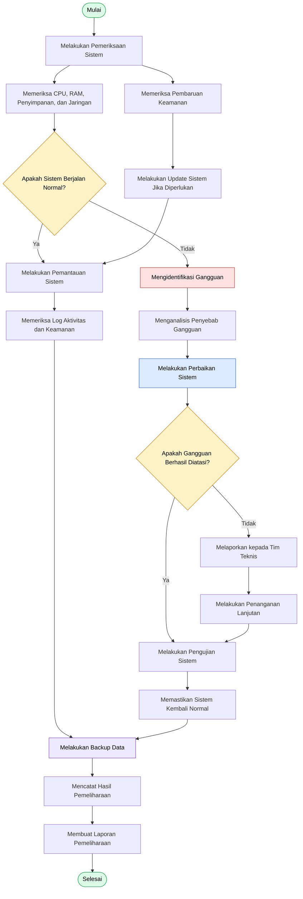

# DIAGRAM ALUR SOP PEMELIHARAAN INFRASTRUKTUR CLOUD

```mermaid
flowchart TD
    A([Mulai]) --> B["Melakukan Pemeriksaan Sistem"]
    B --> C["Memeriksa CPU, RAM, Penyimpanan, dan Jaringan"]
    C --> D{"Apakah Sistem Berjalan Normal?"}

    D -- "Ya" --> E["Melakukan Pemantauan Sistem"]
    E --> F["Memeriksa Log Aktivitas dan Keamanan"]
    F --> G["Melakukan Backup Data"]
    G --> H["Mencatat Hasil Pemeliharaan"]
    H --> I["Membuat Laporan Pemeliharaan"]
    I --> J([Selesai])

    D -- "Tidak" --> K["Mengidentifikasi Gangguan"]
    K --> L["Menganalisis Penyebab Gangguan"]
    L --> M["Melakukan Perbaikan Sistem"]
    M --> N{"Apakah Gangguan Berhasil Diatasi?"}

    N -- "Ya" --> O["Melakukan Pengujian Sistem"]
    O --> P["Memastikan Sistem Kembali Normal"]
    P --> G

    N -- "Tidak" --> Q["Melaporkan kepada Tim Teknis"]
    Q --> R["Melakukan Penanganan Lanjutan"]
    R --> O

    S["Memeriksa Pembaruan Keamanan"] --> T["Melakukan Update Sistem Jika Diperlukan"]
    T --> E

    B --> S

    style A fill:#dcfce7,stroke:#16a34a,color:#000
    style J fill:#dcfce7,stroke:#16a34a,color:#000
    style D fill:#fef3c7,stroke:#d97706,color:#000
    style N fill:#fef3c7,stroke:#d97706,color:#000
    style K fill:#fee2e2,stroke:#dc2626,color:#000
    style M fill:#dbeafe,stroke:#2563eb,color:#000
    style G fill:#ede9fe,stroke:#7c3aed,color:#000
```
