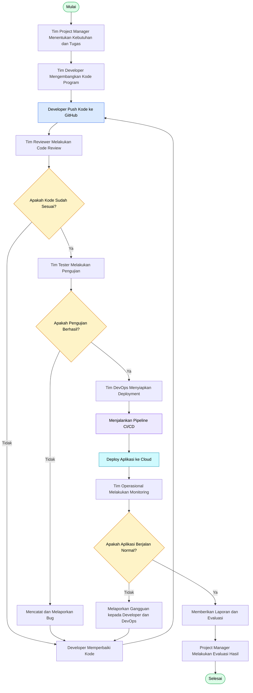

# DIAGRAM ALUR KOLABORASI DEVOPS

```mermaid
flowchart TD
    A([Mulai]) --> B["Tim Project Manager Menentukan Kebutuhan dan Tugas"]
    B --> C["Tim Developer Mengembangkan Kode Program"]
    C --> D["Developer Push Kode ke GitHub"]
    D --> E["Tim Reviewer Melakukan Code Review"]

    E --> F{"Apakah Kode Sudah Sesuai?"}
    F -- "Tidak" --> G["Developer Memperbaiki Kode"]
    G --> D

    F -- "Ya" --> H["Tim Tester Melakukan Pengujian"]
    H --> I{"Apakah Pengujian Berhasil?"}

    I -- "Tidak" --> J["Mencatat dan Melaporkan Bug"]
    J --> G

    I -- "Ya" --> K["Tim DevOps Menyiapkan Deployment"]
    K --> L["Menjalankan Pipeline CI/CD"]
    L --> M["Deploy Aplikasi ke Cloud"]
    M --> N["Tim Operasional Melakukan Monitoring"]

    N --> O{"Apakah Aplikasi Berjalan Normal?"}
    O -- "Tidak" --> P["Melaporkan Gangguan kepada Developer dan DevOps"]
    P --> G

    O -- "Ya" --> Q["Memberikan Laporan dan Evaluasi"]
    Q --> R["Project Manager Melakukan Evaluasi Hasil"]
    R --> S([Selesai])

    style A fill:#dcfce7,stroke:#16a34a,color:#000
    style S fill:#dcfce7,stroke:#16a34a,color:#000
    style F fill:#fef3c7,stroke:#d97706,color:#000
    style I fill:#fef3c7,stroke:#d97706,color:#000
    style O fill:#fef3c7,stroke:#d97706,color:#000
    style D fill:#dbeafe,stroke:#2563eb,color:#000
    style L fill:#ede9fe,stroke:#7c3aed,color:#000
    style M fill:#cffafe,stroke:#0891b2,color:#000
```
