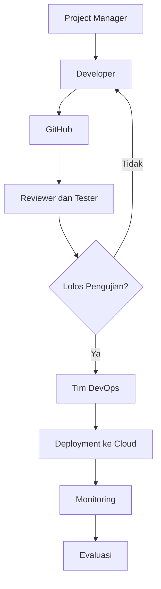

# DIAGRAM ALUR KOLABORASI DEVOPS

```mermaid
flowchart TD
    A["Project Manager"] --> B["Developer"]
    B --> C["GitHub"]
    C --> D["Reviewer dan Tester"]
    D --> E{"Lolos Pengujian?"}
    E -- "Tidak" --> B
    E -- "Ya" --> F["Tim DevOps"]
    F --> G["Deployment ke Cloud"]
    G --> H["Monitoring"]
    H --> I["Evaluasi"]

```
