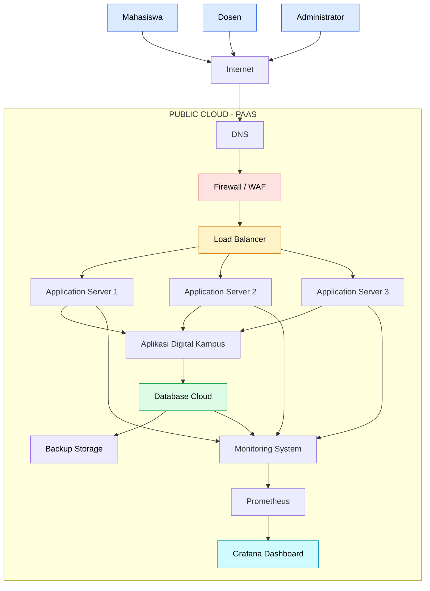

# DIAGRAM ARSITEKTUR CLOUD DIGITAL KAMPUS

```mermaid
flowchart TD

    A["Mahasiswa"]
    B["Dosen"]
    C["Administrator"]

    A --> D["Internet"]
    B --> D
    C --> D

    D --> E["DNS"]
    E --> F["Firewall / WAF"]
    F --> G["Load Balancer"]

    G --> H["Application Server 1"]
    G --> I["Application Server 2"]
    G --> J["Application Server 3"]

    H --> K["Aplikasi Digital Kampus"]
    I --> K
    J --> K

    K --> L["Database Cloud"]
    L --> M["Backup Storage"]

    H --> N["Monitoring System"]
    I --> N
    J --> N
    L --> N

    N --> O["Prometheus"]
    O --> P["Grafana Dashboard"]

    subgraph CLOUD["PUBLIC CLOUD - PAAS"]
        E
        F
        G
        H
        I
        J
        K
        L
        M
        N
        O
        P
    end

    style A fill:#dbeafe,stroke:#2563eb,color:#000
    style B fill:#dbeafe,stroke:#2563eb,color:#000
    style C fill:#dbeafe,stroke:#2563eb,color:#000
    style F fill:#fee2e2,stroke:#dc2626,color:#000
    style G fill:#fef3c7,stroke:#d97706,color:#000
    style L fill:#dcfce7,stroke:#16a34a,color:#000
    style M fill:#ede9fe,stroke:#7c3aed,color:#000
    style P fill:#cffafe,stroke:#0891b2,color:#000
```
